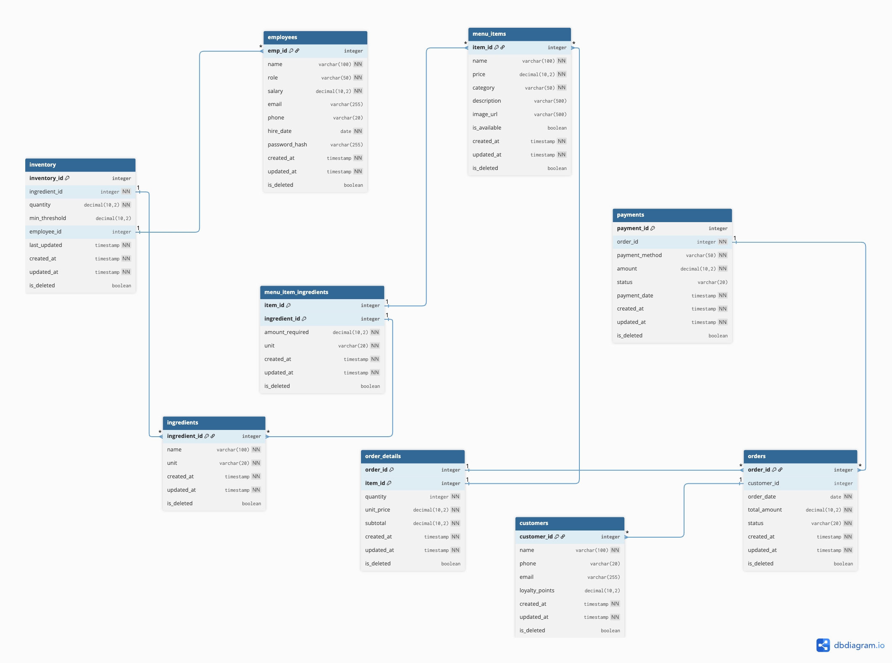

# Database Schema

Complete documentation of the database schema, Entity-Relationship Diagram (ERD), and table structures.

## Entity-Relationship Diagram (ERD)

## Table Structures

### employees

**Purpose:** Stores all employee information for the coffee shop. Used for authentication and authorization based on role.

**Usage:**

- Login/authentication system (uses email + password_hash)
- Access control based on role (Manager, Barista, Cashier)
- Track employee information and work history

**Columns:**

- `emp_id`: Primary key to uniquely identify an employee
- `name`: Employee name
- `role`: Role (Manager, Barista, Cashier) used for access control
- `salary`: Employee salary
- `email`: Email address for login (UNIQUE)
- `phone`: Phone number
- `hire_date`: Date when employee was hired
- `password_hash`: Password hashed with bcrypt for authentication
- `created_at`, `updated_at`: Timestamps for audit trail
- `is_deleted`: Soft delete flag

| Column        | Type          | Constraints             | Description                      |
| ------------- | ------------- | ----------------------- | -------------------------------- |
| emp_id        | INTEGER       | PRIMARY KEY             | Employee ID                      |
| name          | VARCHAR(100)  | NOT NULL                | Employee name                    |
| role          | VARCHAR(50)   | NOT NULL                | Role (Manager, Barista, Cashier) |
| salary        | DECIMAL(10,2) | NOT NULL, CHECK > 0     | Salary                           |
| email         | VARCHAR(255)  | UNIQUE                  | Email address                    |
| phone         | VARCHAR(20)   |                         | Phone number                     |
| hire_date     | DATE          | NOT NULL                | Hire date                        |
| password_hash | VARCHAR(255)  |                         | Bcrypt password hash             |
| created_at    | TIMESTAMP     | NOT NULL, DEFAULT NOW() | Creation timestamp               |
| updated_at    | TIMESTAMP     | NOT NULL, DEFAULT NOW() | Update timestamp                 |
| is_deleted    | BOOLEAN       | DEFAULT FALSE           | Soft delete flag                 |

**Indexes:**

- `ix_employees_email` on `email` (UNIQUE, WHERE email IS NOT NULL)
- `ix_employees_phone` on `phone` (UNIQUE, WHERE phone IS NOT NULL)

### customers

**Purpose:** Stores customer information and loyalty points system.

**Usage:**

- Manage customer data
- Track loyalty points for promotions
- Link with orders to view purchase history

**Columns:**

- `customer_id`: Primary key to uniquely identify a customer
- `name`: Customer name
- `phone`: Phone number (UNIQUE) for identification
- `email`: Email address (UNIQUE) for contact
- `loyalty_points`: Loyalty points that can be redeemed for promotions
- `created_at`, `updated_at`: Timestamps for audit trail
- `is_deleted`: Soft delete flag

| Column         | Type          | Constraints             | Description        |
| -------------- | ------------- | ----------------------- | ------------------ |
| customer_id    | INTEGER       | PRIMARY KEY             | Customer ID        |
| name           | VARCHAR(100)  | NOT NULL                | Customer name      |
| phone          | VARCHAR(20)   | UNIQUE                  | Phone number       |
| email          | VARCHAR(255)  | UNIQUE                  | Email address      |
| loyalty_points | DECIMAL(10,2) | DEFAULT 0, CHECK >= 0   | Loyalty points     |
| created_at     | TIMESTAMP     | NOT NULL, DEFAULT NOW() | Creation timestamp |
| updated_at     | TIMESTAMP     | NOT NULL, DEFAULT NOW() | Update timestamp   |
| is_deleted     | BOOLEAN       | DEFAULT FALSE           | Soft delete flag   |

**Indexes:**

- `idx_customers_email` on `email`
- `idx_customers_phone` on `phone`

### menu_items

**Purpose:** Stores menu items catalog (coffee, beverages, desserts).

**Usage:**

- Display menu for customers to choose from
- Store prices and item details
- Control visibility with `is_available`
- Group items by `category`

**Columns:**

- `item_id`: Primary key to uniquely identify a menu item
- `name`: Item name (UNIQUE) e.g., "Espresso", "Cappuccino"
- `price`: Selling price
- `category`: Category e.g., "Coffee", "Tea", "Bakery"
- `description`: Item description
- `image_url`: Image URL for the item
- `is_available`: Whether the item is available for sale
- `created_at`, `updated_at`: Timestamps for audit trail
- `is_deleted`: Soft delete flag

| Column       | Type          | Constraints             | Description        |
| ------------ | ------------- | ----------------------- | ------------------ |
| item_id      | INTEGER       | PRIMARY KEY             | Menu item ID       |
| name         | VARCHAR(100)  | NOT NULL, UNIQUE        | Item name          |
| price        | DECIMAL(10,2) | NOT NULL, CHECK > 0     | Price              |
| category     | VARCHAR(50)   | NOT NULL                | Category           |
| description  | VARCHAR(500)  |                         | Description        |
| image_url    | VARCHAR(500)  |                         | Image URL          |
| is_available | BOOLEAN       | DEFAULT TRUE            | Availability       |
| created_at   | TIMESTAMP     | NOT NULL, DEFAULT NOW() | Creation timestamp |
| updated_at   | TIMESTAMP     | NOT NULL, DEFAULT NOW() | Update timestamp   |
| is_deleted   | BOOLEAN       | DEFAULT FALSE           | Soft delete flag   |

**Indexes:**

- `ix_menu_items_name` on `name` (UNIQUE)
- `ix_menu_items_category` on `category`
- `ix_menu_items_is_available` on `is_available`
- `idx_menu_item_category_available` on `(category, is_available)`

### ingredients

**Purpose:** Stores all ingredients used in the shop (e.g., coffee, milk, sugar).

**Usage:**

- Define ingredients available in the system
- Link with `menu_item_ingredients` to specify recipes
- Link with `inventory` to track stock

**Columns:**

- `ingredient_id`: Primary key to uniquely identify an ingredient
- `name`: Ingredient name (UNIQUE) e.g., "Coffee Beans", "Milk"
- `unit`: Unit of measurement e.g., "kg", "liter", "shot"
- `created_at`, `updated_at`: Timestamps for audit trail
- `is_deleted`: Soft delete flag

| Column        | Type         | Constraints             | Description         |
| ------------- | ------------ | ----------------------- | ------------------- |
| ingredient_id | INTEGER      | PRIMARY KEY             | Ingredient ID       |
| name          | VARCHAR(100) | NOT NULL, UNIQUE        | Ingredient name     |
| unit          | VARCHAR(20)  | NOT NULL                | Unit of measurement |
| created_at    | TIMESTAMP    | NOT NULL, DEFAULT NOW() | Creation timestamp  |
| updated_at    | TIMESTAMP    | NOT NULL, DEFAULT NOW() | Update timestamp    |
| is_deleted    | BOOLEAN      | DEFAULT FALSE           | Soft delete flag    |

**Indexes:**

- `idx_ingredients_name` on `name`

### menu_item_ingredients

**Purpose:** Junction table linking menu items with ingredients (Many-to-Many). Stores recipe for each menu item.

**Usage:**

- Specify which ingredients are needed for each menu item and how much
- Calculate menu item cost
- Check if there are enough ingredients to make a menu item

**Columns:**

- `item_id`: Foreign key → menu_items (the menu item)
- `ingredient_id`: Foreign key → ingredients (the ingredient used)
- `amount_required`: Amount required e.g., 0.02 kg, 0.12 liter
- `unit`: Unit of measurement for amount_required
- `created_at`, `updated_at`: Timestamps for audit trail
- `is_deleted`: Soft delete flag

| Column          | Type          | Constraints                   | Description        |
| --------------- | ------------- | ----------------------------- | ------------------ |
| item_id         | INTEGER       | PRIMARY KEY, FK → menu_items  | Menu item ID       |
| ingredient_id   | INTEGER       | PRIMARY KEY, FK → ingredients | Ingredient ID      |
| amount_required | DECIMAL(10,2) | NOT NULL, CHECK > 0           | Amount required    |
| unit            | VARCHAR(20)   | NOT NULL                      | Unit               |
| created_at      | TIMESTAMP     | NOT NULL, DEFAULT NOW()       | Creation timestamp |
| updated_at      | TIMESTAMP     | NOT NULL, DEFAULT NOW()       | Update timestamp   |
| is_deleted      | BOOLEAN       | DEFAULT FALSE                 | Soft delete flag   |

### inventory

**Purpose:** Tracks ingredient stock in the shop. Used for inventory management and low stock alerts.

**Usage:**

- Track current quantity of ingredients
- Alert when stock falls below `min_threshold`
- Record who last updated the stock

**Columns:**

- `inventory_id`: Primary key to uniquely identify a record
- `ingredient_id`: Foreign key → ingredients (the ingredient being tracked)
- `quantity`: Current quantity in stock
- `min_threshold`: Minimum level that triggers alerts (reorder point)
- `employee_id`: Foreign key → employees (employee who last updated)
- `last_updated`: Time when last updated
- `created_at`, `updated_at`: Timestamps for audit trail
- `is_deleted`: Soft delete flag

| Column        | Type          | Constraints                | Description           |
| ------------- | ------------- | -------------------------- | --------------------- |
| inventory_id  | INTEGER       | PRIMARY KEY                | Inventory ID          |
| ingredient_id | INTEGER       | NOT NULL, FK → ingredients | Ingredient ID         |
| quantity      | DECIMAL(10,2) | NOT NULL, CHECK >= 0       | Current quantity      |
| min_threshold | DECIMAL(10,2) | DEFAULT 0, CHECK >= 0      | Minimum threshold     |
| employee_id   | INTEGER       | FK → employees             | Employee who updated  |
| last_updated  | TIMESTAMP     | NOT NULL, DEFAULT NOW()    | Last update timestamp |
| created_at    | TIMESTAMP     | NOT NULL, DEFAULT NOW()    | Creation timestamp    |
| updated_at    | TIMESTAMP     | NOT NULL, DEFAULT NOW()    | Update timestamp      |
| is_deleted    | BOOLEAN       | DEFAULT FALSE              | Soft delete flag      |

**Indexes:**

- `idx_inventory_ingredient_quantity` on `(ingredient_id, quantity)`

### orders

**Purpose:** Stores order information (Order Header). Contains summary data for each order.

**Usage:**

- Record customer orders
- Track order status (pending/completed/cancelled)
- Calculate total amount
- Link with `order_details` to view items in the order

**Columns:**

- `order_id`: Primary key to uniquely identify an order
- `customer_id`: Foreign key → customers (customer who placed order, nullable for walk-in customers)
- `order_date`: Date when order was placed
- `total_amount`: Total amount of the order
- `status`: Order status (pending/completed/cancelled)
- `created_at`, `updated_at`: Timestamps for audit trail
- `is_deleted`: Soft delete flag

| Column       | Type          | Constraints             | Description                          |
| ------------ | ------------- | ----------------------- | ------------------------------------ |
| order_id     | INTEGER       | PRIMARY KEY             | Order ID                             |
| customer_id  | INTEGER       | FK → customers          | Customer ID (nullable)               |
| order_date   | DATE          | NOT NULL                | Order date                           |
| total_amount | DECIMAL(10,2) | NOT NULL, CHECK >= 0    | Total amount                         |
| status       | VARCHAR(20)   | NOT NULL, CHECK IN      | Status (pending/completed/cancelled) |
| created_at   | TIMESTAMP     | NOT NULL, DEFAULT NOW() | Creation timestamp                   |
| updated_at   | TIMESTAMP     | NOT NULL, DEFAULT NOW() | Update timestamp                     |
| is_deleted   | BOOLEAN       | DEFAULT FALSE           | Soft delete flag                     |

**Indexes:**

- `idx_orders_customer` on `customer_id`
- `idx_orders_date` on `order_date`
- `idx_orders_status` on `status`

### order_details

**Purpose:** Stores item details for each order (Order Line Items). One order can have multiple items.

**Usage:**

- Record items that customer ordered in each order
- Store unit price and subtotal for each item
- Calculate total amount of the order

**Columns:**

- `order_id`: Foreign key → orders (the order this item belongs to)
- `item_id`: Foreign key → menu_items (the item ordered)
- `quantity`: Quantity ordered
- `unit_price`: Unit price at time of order (stored to prevent price changes)
- `subtotal`: Subtotal for this item (quantity × unit_price)
- `created_at`, `updated_at`: Timestamps for audit trail
- `is_deleted`: Soft delete flag

| Column     | Type          | Constraints                  | Description        |
| ---------- | ------------- | ---------------------------- | ------------------ |
| order_id   | INTEGER       | PRIMARY KEY, FK → orders     | Order ID           |
| item_id    | INTEGER       | PRIMARY KEY, FK → menu_items | Menu item ID       |
| quantity   | INTEGER       | NOT NULL, CHECK > 0          | Quantity           |
| unit_price | DECIMAL(10,2) | NOT NULL, CHECK >= 0         | Unit price         |
| subtotal   | DECIMAL(10,2) | NOT NULL, CHECK >= 0         | Subtotal           |
| created_at | TIMESTAMP     | NOT NULL, DEFAULT NOW()      | Creation timestamp |
| updated_at | TIMESTAMP     | NOT NULL, DEFAULT NOW()      | Update timestamp   |
| is_deleted | BOOLEAN       | DEFAULT FALSE                | Soft delete flag   |

### payments

**Purpose:** Records payment information for each order. Tracks payment status.

**Usage:**

- Record customer payments
- Track payment status (pending/completed/failed)
- Record payment method (cash, credit card, etc.)
- Used for accounting and reporting

**Columns:**

- `payment_id`: Primary key to uniquely identify a payment
- `order_id`: Foreign key → orders (the order being paid)
- `payment_method`: Payment method e.g., "cash", "credit_card", "promptpay"
- `amount`: Payment amount
- `status`: Payment status (pending/completed/failed)
- `payment_date`: Date and time when payment was made
- `created_at`, `updated_at`: Timestamps for audit trail
- `is_deleted`: Soft delete flag

| Column         | Type          | Constraints              | Description                       |
| -------------- | ------------- | ------------------------ | --------------------------------- |
| payment_id     | INTEGER       | PRIMARY KEY              | Payment ID                        |
| order_id       | INTEGER       | NOT NULL, FK → orders    | Order ID                          |
| payment_method | VARCHAR(50)   | NOT NULL                 | Payment method                    |
| amount         | DECIMAL(10,2) | NOT NULL, CHECK > 0      | Payment amount                    |
| status         | VARCHAR(20)   | DEFAULT 'pending', CHECK | Status (pending/completed/failed) |
| payment_date   | TIMESTAMP     | NOT NULL, DEFAULT NOW()  | Payment date                      |
| created_at     | TIMESTAMP     | NOT NULL, DEFAULT NOW()  | Creation timestamp                |
| updated_at     | TIMESTAMP     | NOT NULL, DEFAULT NOW()  | Update timestamp                  |
| is_deleted     | BOOLEAN       | DEFAULT FALSE            | Soft delete flag                  |

**Indexes:**

- `ix_payments_order_id` on `order_id`
- `ix_payments_status` on `status`
- `ix_payments_payment_date` on `payment_date`
- `idx_payment_order_status` on `(order_id, status)`
- `idx_payment_date_status` on `(payment_date, status)`

## Relationships

### One-to-Many

- `customers` → `orders` (1:N)
- `orders` → `order_details` (1:N)
- `orders` → `payments` (1:N)
- `ingredients` → `inventory` (1:N)
- `menu_items` → `order_details` (1:N)
- `employees` → `inventory` (1:N)

### Many-to-Many

- `menu_items` ↔ `ingredients` (via `menu_item_ingredients`)

## Constraints Summary

### Primary Keys

- All tables have primary keys
- Composite keys used for junction tables

### Foreign Keys

- All foreign keys have `ON DELETE CASCADE` or appropriate action
- Referential integrity enforced

### Check Constraints

- Price values must be > 0
- Quantity values must be >= 0
- Status values restricted to specific enums

### Unique Constraints

- Employee email
- Customer email and phone
- Menu item name
- Ingredient name

## Indexes Summary

### Performance Indexes

- Email indexes for fast lookups
- Category and status indexes for filtering
- Composite indexes for common query patterns
- Foreign key indexes for join optimization

## Related Documentation

- [Normalization](normalization.md) - Database normalization principles and design decisions
- [Constraints & Indexes](constraints-indexes.md) - Detailed constraint and index documentation
- [Migrations](migrations.md) - Database migration guide and version control
- [Transactions](transactions.md) - Transaction management and ACID properties
- [Query Optimization](query-optimization.md) - Query performance optimization techniques
